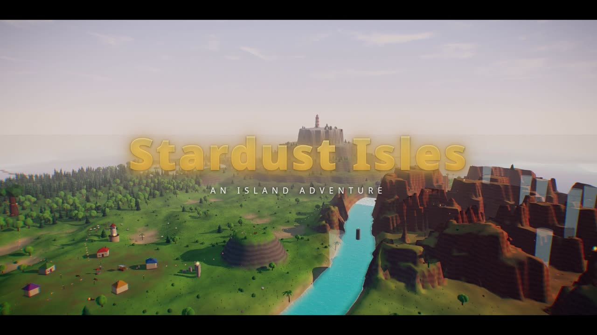
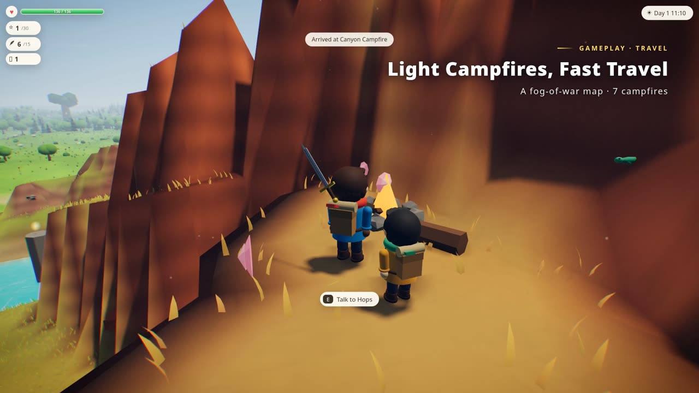

# ✨ Stardust Isles



**Stardust Isles** is a cozy 3D exploration and collection game that runs in your browser. A meteor shower has shattered the star in the lighthouse on top of Frostpeak, and its pieces, the *stardust shards*, are scattered across the islands. Explore, help the islanders, unlock new abilities and gather 20 shards to relight the lighthouse. Beyond the coast lies an endless, procedurally generated archipelago full of treasure and danger.

Everything is made in code with [Three.js](https://threejs.org/): there are **no asset files**. Models, terrain, textures, particle effects, music and sound effects are all generated at runtime. The game is playable in **English and Chinese (中文)**.

<p align="center"></p>

| | |
|---|---|
|  |  |
|  |  |
|  |  |

## ⚙️ Setup

You need [Node.js](https://nodejs.org/) 18 or newer and a browser with WebGL 2. A dedicated GPU is recommended for the higher graphics presets.

```bash
git clone https://github.com/Danzer1xxxxChan/Stardust_Isles.git
cd Stardust_Isles
npm install
npm run build
npm start              # open http://localhost:8080
```

- **Port**: `PORT=3000 npm start`
- **Dev mode with hot reload**: `npm run dev` (port 5173)
- **Remote server**: forward the port with `ssh -L 8080:localhost:8080 <server>`, then open it locally
- **Language**: use the 中文 / English buttons on the title screen, or *Settings → Language*
- **Graphics**: *Settings → Graphics* (Low / Medium / High / Ultra)
- **Optional AI small talk with the residents**: `ANTHROPIC_API_KEY=... npm start` (set `AI_MODEL=...` to choose a model). Without a key the game works exactly the same; the "Just chat" option is simply hidden.

Progress is saved automatically in the browser (localStorage).

## 🎮 Controls

| Key | Action |
|---|---|
| WASD / arrow keys | Move (walk into a steep slope to climb) |
| Mouse | Look around (click to lock, or drag with the right button) · wheel to zoom |
| Space | Jump · in mid-air: double jump / open the glider (hold) |
| Shift | Sprint / swim faster |
| Left click / J | Attack (3-hit combo, plunge attack in mid-air) |
| Q | Dodge roll (brief invulnerability) |
| E | Interact: talk, open chests, fish, light campfires… |
| C | Camera (photograph things for the field guide) |
| Tab / M / Esc | Menu / map / pause |

## 🗺️ What's in the game

**A hand-crafted island…** Six regions: Breezy Meadows and the village, Misty Woods, Red Rock Canyon, Coral Coast, Crystal Lake and the snowy Frostpeak. There is a day/night cycle (one day lasts about 8 minutes) and rain, and some creatures and puzzles only appear at night or in the rain.

**…and the endless Far Isles.** Walk out along a sandbar causeway, swim or glide past the coast, and the world keeps generating as you go. You will find five biomes (Verdant Isles, Fogwood Sea, Redrock Badlands, Frost Plains and Crystal Shores), each with its own terrain, plants and wildlife. The farther you travel, the stronger the enemies and the richer the chests.

**Progression.** 30 stardust shards (20 relight the lighthouse), 15 golden feathers that raise your climbing stamina, about 300 shell coins, chests, 8 hats and a 41-entry field guide. Eight abilities open up new places and ways to play: camera, glider, lantern, fishing rod, flippers, shovel, bounce boots and a stardust compass.

**Residents and quests.** Nine islanders, each with a story and a request: find lost sheep, gather glowing mushrooms, take a fishing lesson, race through the canyon, read the stars, bring hot cocoa to a freezing climber, and more.

**Puzzles and challenges.** Platforming, glide-ring courses with updrafts, pushing stone blocks, aiming light beams with mirrors, night-only constellation altars, chasing a starlight fox, digging with treasure maps, and a fishing minigame.

**Combat.** Sword combos, plunge attacks and dodge rolls with hit-stop, sword trails and damage numbers. Your enemies are the *Gloom*: slimes, shade wolves and the elite Crystal Golem. Wildlife has health bars too, and fainted animals turn into starlight and come back later. If you fall, you wake up at the nearest campfire.

**Systems.** Campfires for resting and fast travel, a fog-of-war map, a photo field guide, a wardrobe, autosave, and generative music and ambience.

**Graphics.** Bloom, ambient occlusion, color grading and anti-aliasing; procedural clouds; stylized water with reflections, foam and caustics; around 90,000 blades of wind-blown grass; swaying vegetation; rim-lit characters; and ambient particles such as pollen, fireflies and snow.

## 🧰 Project layout

```
src/
  world/    terrain & far-isle streaming, vegetation, grass, sky, water, structures
  player/   character models & animation, controller, camera
  game/     quests, residents, challenges, combat & enemies, fishing, photos, save state
  render/   post-processing & graphics presets
  ui/       HUD, dialog, menus & map
  audio/    synthesized SFX, generative music, ambience
  i18n/     English string tables (Chinese source strings are the keys)
server/     static server + optional AI chat endpoint
tools/      headless tests, screenshot tours, i18n checks, promo-video recorder
```

**Testing** (start the server first with `npm start`):

```bash
npm test               # 19 gameplay checks in headless Chromium
npm run test:combat    # combat and far-isle checks
npm run i18n:check     # find untranslated strings
```

`tools/promo/` records the trailer frame by frame. The game itself performs the shots, and a virtual clock keeps the timing exact (see [docs/README.zh-CN.md](docs/README.zh-CN.md) for details).

---

📖 [中文说明 (Chinese README)](docs/README.zh-CN.md) · 📝 [Design notes (Chinese)](docs/UPGRADE_PLAN.md)
