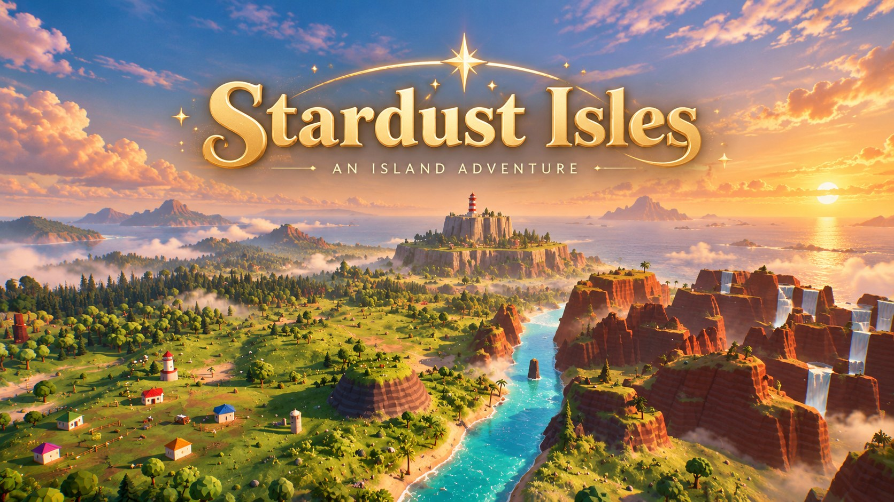
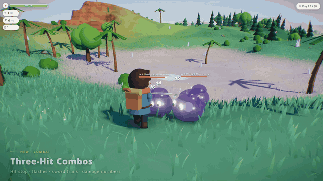
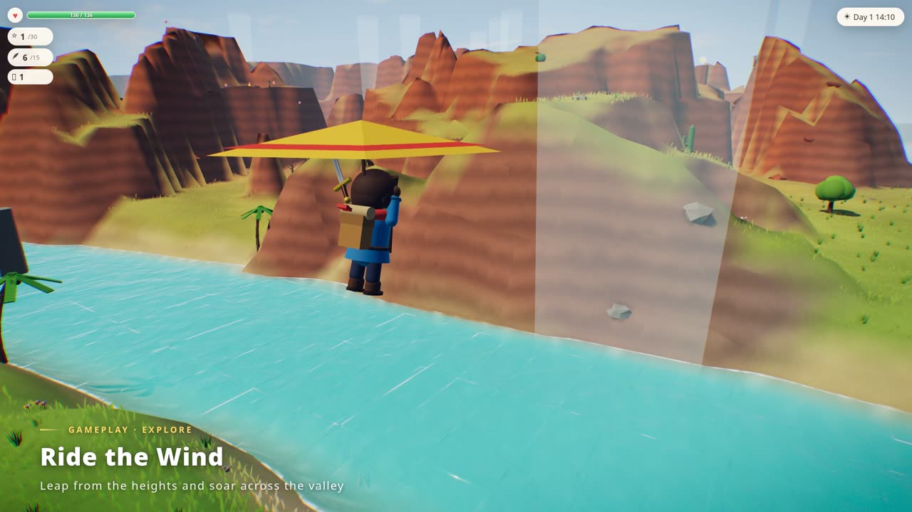
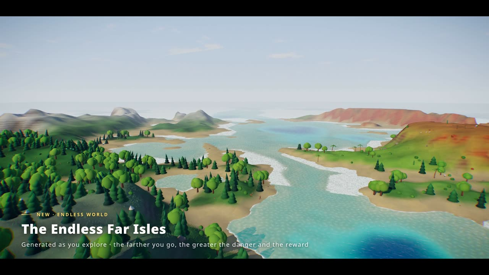
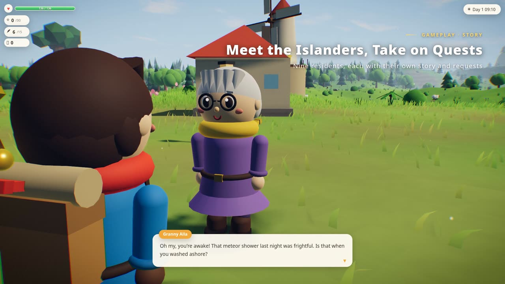
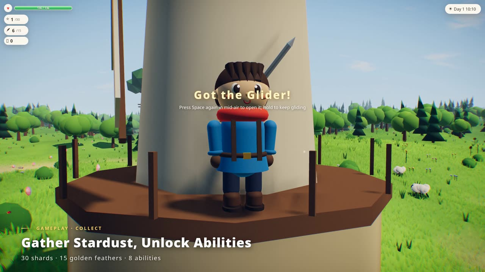
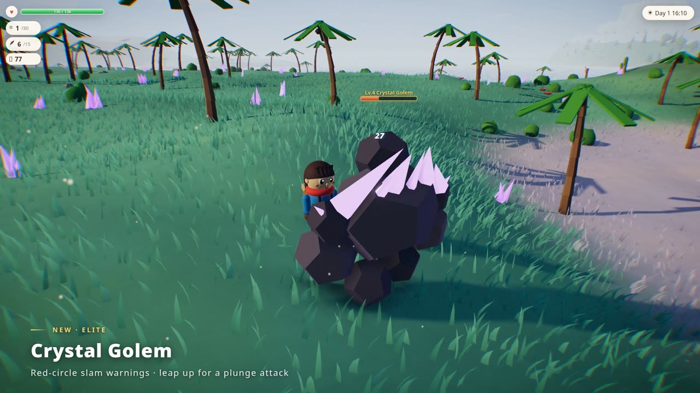
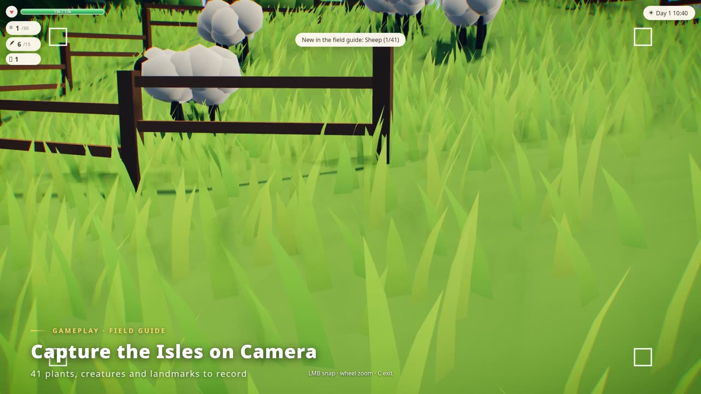
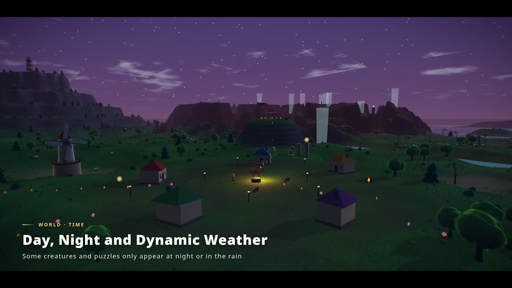

<div align="center">



**A cozy 3D island adventure in your browser, built entirely from code.**

<a href="https://github.com/Danzer1xxxxChan/Stardust_Isles/releases/tag/v0.2.0"></a>
<a href="#setup"></a>
<a href="https://threejs.org"></a>
<br>


<a href="LICENSE"></a>

</div>

---

A meteor shower has shattered the star inside the lighthouse on top of Frostpeak, and its pieces, the *stardust shards*, now lie scattered across the islands. Explore, help the islanders, unlock new abilities and gather 20 shards to relight the lighthouse. Then sail past the coast into an archipelago that never ends.

<p align="center"><b>TL;DR</b>: a hand-crafted island plus an endless procedural world, with exploration, quests, puzzles and real-time combat, all in about 1 MB of JavaScript and no art, audio or texture files.</p>

## ✨ Highlights

<table>
<tr>
<td width="25%" align="center"><h3>🎨<br>100% code,<br>0 assets</h3></td>
<td>Every mesh, texture, particle effect, piece of music and sound effect is <b>generated at runtime</b>. The whole game ships as roughly <b>1 MB of JavaScript</b> (about 310 KB gzipped) with no images, models or audio files.</td>
</tr>
<tr>
<td align="center"><h3>🌊<br>An endless<br>world</h3></td>
<td>The hand-crafted island blends into the <b>endless Far Isles</b>: procedural terrain streamed in 75 m chunks with level of detail, <b>five biomes</b>, and enemies and loot that grow stronger the farther you travel. The world is generated by deterministic formulas, so the same place is always the same place, and it never has to be saved.</td>
</tr>
<tr>
<td align="center"><h3>⚔️<br>Cozy meets<br>action</h3></td>
<td>Nine islanders with quests, eight unlockable abilities and plenty of puzzles sit alongside <b>real-time combat</b>: a three-hit combo, plunge attacks and dodge rolls with hit-stop, sword trails and damage numbers, against three types of enemy, including an elite golem that telegraphs its attacks.</td>
</tr>
<tr>
<td align="center"><h3>🌅<br>Rich visuals<br>in a browser tab</h3></td>
<td>A stylized look with real-time post-processing (bloom, ambient occlusion, color grading), procedural clouds, water with reflections, foam and caustics, <b>about 90,000 blades of wind-blown grass</b>, a day/night cycle with rain, and fireflies. Four graphics presets let it run on anything from a laptop to a desktop GPU.</td>
</tr>
</table>

## 🎬 Trailer

<p align="center"></p>
<p align="center">▶ The full 107-second trailer is in the <a href="https://github.com/Danzer1xxxxChan/Stardust_Isles/releases/tag/v0.2.0"><b>v0.2.0 release</b></a> (English and 中文). It was recorded in-engine: the game performs every shot itself.</p>

<a id="setup"></a>

## ⚙️ Setup

You need [Node.js](https://nodejs.org/) 18 or newer and a browser with WebGL 2. A dedicated GPU is recommended for the High and Ultra presets.

```bash
git clone https://github.com/Danzer1xxxxChan/Stardust_Isles.git
cd Stardust_Isles
npm install
npm run build
npm start                      # open http://localhost:8080
```

| Option | How |
|---|---|
| 🌐 Language | **中文 / English** buttons on the title screen, or *Settings → Language* |
| 🖥️ Graphics | *Settings → Graphics*: Low / Medium / High / Ultra |
| 🔧 Port & dev mode | `PORT=3000 npm start` · `npm run dev` for hot reload |
| 🛰️ Remote server | `ssh -L 8080:localhost:8080 <server>`, then open `http://localhost:8080` locally |
| 🤖 AI small talk *(optional)* | `ANTHROPIC_API_KEY=... npm start` lets you chat freely with the islanders. Everything else works without a key. |

Progress is saved automatically in the browser.

## 🎮 Controls

| Key | Action |
|---|---|
| WASD / arrow keys | Move (walk into a steep slope to climb) |
| Mouse | Look around (click to lock, or drag with the right button) · wheel to zoom |
| Space | Jump · in mid-air: double jump / open the glider (hold) |
| Shift | Sprint / swim faster |
| Left click / J | Attack (3-hit combo, plunge attack in mid-air) |
| Q | Dodge roll (brief invulnerability) |
| E | Interact: talk, open chests, fish, light campfires… |
| C | Camera, for the field guide |
| Tab / M / Esc | Menu / map / pause |

## 🗺️ What's in the game

<p align="center">
<b>6</b> hand-crafted regions · <b>∞</b> Far Isles in <b>5</b> biomes · <b>30</b> stardust shards · <b>15</b> golden feathers · <b>8</b> abilities · <b>9</b> islanders · <b>41</b> field-guide entries · <b>3</b> enemy types
</p>

<table>
<tr>
<td width="50%"></td>
<td><h3>🏝️ Explore</h3>
Climb any cliff, glide across valleys and swim the coast. Six regions surround the village: <b>Breezy Meadows</b>, the <b>Misty Woods</b> (you need a lantern to go deep), <b>Red Rock Canyon</b>, the <b>Coral Coast</b>, <b>Crystal Lake</b> and the snowy <b>Frostpeak</b>.</td>
</tr>
<tr>
<td></td>
<td><h3>🌊 The endless Far Isles</h3>
Walk out along a sandbar causeway and the world keeps generating as you go: <b>Verdant Isles</b>, the <b>Fogwood Sea</b>, the <b>Redrock Badlands</b>, the <b>Frost Plains</b> and the <b>Crystal Shores</b>. Each has its own terrain, plants and wildlife. The farther you go, the higher the enemy level and the richer the chests.</td>
</tr>
<tr>
<td></td>
<td><h3>📜 Islanders & quests</h3>
Nine residents, each with a story and a request: round up Mia's lost sheep, gather glowing mushrooms for Kuku, take Old Hai's fishing lesson, race Hops through the canyon, read the stars with Hoshino, or bring hot cocoa to a freezing climber.</td>
</tr>
<tr>
<td></td>
<td><h3>⭐ Collect & unlock</h3>
Shards light the way to the ending, and golden feathers raise your climbing stamina. Each ability opens new places and ways to play: 📷 camera · 🪂 glider · 🏮 lantern · 🎣 fishing rod · 🤿 flippers · ⛏️ shovel · 👢 bounce boots · 🧭 stardust compass.</td>
</tr>
<tr>
<td></td>
<td><h3>⚔️ Combat</h3>
Fight the <b>Gloom</b>: bouncing slimes, shade wolves that crouch before they lunge, and the elite <b>Crystal Golem</b>, whose slams are marked by a red circle on the ground. Combo, roll through attacks, leap for a plunge, then collect coins and healing orbs. Fall, and you wake up at the nearest campfire.</td>
</tr>
<tr>
<td></td>
<td><h3>🧩 Puzzles & systems</h3>
Glide-ring courses with updrafts, stone-block pushing, light-beam mirrors, night-only constellation altars, a starlight fox chase, treasure maps and a fishing minigame. There is also a photo field guide, a hat wardrobe, campfire fast travel, a fog-of-war map, and generative music with ambient sound.</td>
</tr>
<tr>
<td></td>
<td><h3>🌅 A living world</h3>
A full day lasts about 8 minutes, with rainstorms, sunsets and starry nights. Some creatures and puzzles only appear after dark or in the rain.</td>
</tr>
</table>

## 🧰 Project layout

```
src/
  world/    terrain & far-isle streaming, vegetation, grass, sky, water, structures
  player/   character models & animation, controller, camera
  game/     quests, islanders, challenges, combat & enemies, fishing, photos, save state
  render/   post-processing & graphics presets
  ui/       HUD, dialog, menus & map
  audio/    synthesized SFX, generative music, ambience
  i18n/     English string tables (the Chinese source strings are the keys)
server/     static server + optional AI chat endpoint
tools/      headless tests, screenshot tours, i18n checks, trailer recorder
docs/       Chinese README, design notes, screenshots
```

## 🧪 Testing

Start the server with `npm start`, then:

```bash
npm test               # 19 gameplay checks in headless Chromium
npm run test:combat    # combat and Far Isles checks
npm run i18n:check     # find untranslated strings
```

The trailer recorder in `tools/promo/` drives the game frame by frame on a virtual clock, so every shot keeps exact timing however slowly it renders. See the [Chinese README](docs/README.zh-CN.md) for details.

## 📄 License

Released under the [MIT License](LICENSE).

## 🙏 Acknowledgements

Built with [Three.js](https://threejs.org/) and [Vite](https://vitejs.dev/). The optional AI small talk uses the [Anthropic API](https://docs.anthropic.com/).

---

<p align="center">📖 <a href="docs/README.zh-CN.md">中文说明</a> · 📝 <a href="docs/UPGRADE_PLAN.md">Design notes (中文)</a></p>

<p align="center">If you enjoyed your trip to the isles, a star ⭐ would be greatly appreciated!</p>

<p align="center"><a href="https://star-history.com/#Danzer1xxxxChan/Stardust_Isles&Date"></a></p>
